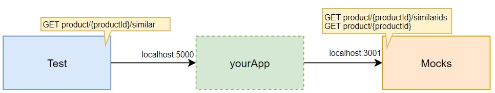

# Backend dev technical test

We want to offer a new feature to our customers showing similar products to the one they are currently seeing. To do this we agreed with our front-end applications to create a new REST API operation that will provide them the product detail of the similar products for a given one. [Here](./adapters/src/main/resources/similarProducts.yaml) is the contract we agreed.

We already have an endpoint that provides the product Ids similar for a given one. We also have another endpoint that returns the product detail by product Id. [Here](./adapters/src/main/resources/existingApis.yaml) is the documentation of the existing APIs.

**Create a Spring boot application that exposes the agreed REST API on port 5000.**



Note that _Test_ and _Mocks_ components are given, you must only implement _yourApp_.

## Design Decisions & Considerations

Before starting the implementation, I analyzed the requirements and identified a significant scalability challenge regarding the API contract.

### Scalability Challenge and performance analysis and considerations

I identified a potential trade-off in scenarios where the volume of data retrieved might **exceed** standard limits.
In a real-world scenario, a product could potentially have thousands or millions of similar matches. Since the current API contract does not define any pagination or limits, attempting to fetch details for all of them would cause:
* **Performance degradation:** High latency and memory consumption.
* **System instability:** Potential saturation of downstream services.

**The Solution: Top-N Approach**
Since modifying the API contract to add pagination was outside the scope, I decided to implement a **Top-N truncation strategy**.
* The system fetches the IDs but only processes the details for the most relevant ones (e.g., the first 20).
* This approach ensures O(1) memory usage regardless of the input size, significantly improving performance and resilience.

**Configuration:**
* `CONFIG_SIMILAR_PRODUCTS_LIMIT` env var or `config.similiar-products.limit` yaml prop: Determines the max number of products to return (Default: `20`).
* `CONFIG_SIMILAR_PRODUCTS_PARALLEL_REQUESTS` env var or `config.similar-products.parallel-requests`yaml prop: Determines the concurrency level for parallel fetching (Default: `10`).

> Host for existingAPIs connection is wrapped in the adapter by the open api generator (this is good for integration), but sometimes is not good approach letting external or third party library generate code like that.
> Anyway, for this test I kept it as is to focus on the main requirements.

### Tech Stack: Why WebFlux?

I chose **Spring WebFlux** to build a reactive, non-blocking application and aligned with functional programming. And the needs for this feature, require a consideration for millions or thousands of results from similar products ids endpoint.
In that case, a traditional blocking approach would lead to thread exhaustion and poor scalability. (except using Virtual Threads, see below).

**Why not Virtual Threads (Java 21)?**
I evaluated using Spring MVC with Java 21 Virtual Threads (Project Loom), which is a valid modern approach for I/O-bound tasks. However, I decided on **WebFlux** for two reasons:
1.  **Scatter-Gather Pattern:** The requirement involves fetching multiple resources in parallel and aggregating them. WebFlux's functional operators (`flatMap`, `zip`, `collectList`) provide a more declarative and natural way to model this specific flow compared to imperative loops.
2.  **Personal Proficiency:** I strongly believe that the declarative programming model results in more readable and maintainable code for stream processing tasks like this one.

### Other Approaches Evaluated

To have in context, here are other strategies I considered during the design phase:
* **Virtual Threads:** Excellent for blocking I/O, but requires more manual orchestration to achieve the same declarative elegance as WebFlux for this specific aggregation use case.
* **Pagination:** The ideal solution, but it would require breaking the provided API contract. (and thus was not implemented).
* **Caching:** Implementing a caching layer (e.g., Caffeine/Redis) for product details would be the next logical step for production readiness to reduce network overhead. (requires additional infrastructure not covered in this test).

---

## Standardization and Code Structure (Hexagonal Architecture)

I structured the code following a **Multi-Module Maven** approach based on **Hexagonal Architecture** (Ports & Adapters). This promotes strictly separated concerns and testability.

I deliberately separated the *Inbound* and *Outbound* adapters into different modules to enforce dependency inversion and prevent architectural leakage.

> I now this is simply a small project, but I wanted to demonstrate best practices that would scale in larger applications.

* **domain**: The core. Contains entities and pure business logic. It has **zero dependencies** on frameworks or external libraries.
* **application**: Orchestration layer. Contains the `Services` and defines the `Ports` (interfaces) that the infrastructure layer must implement, also some application configurations like similar products limits.
* **adapters**: Includes in and out ports implementations:
  * The entry point. Handles incoming HTTP requests and maps them to application use cases.
  * The exit point. Implements the outbound ports using `WebClient` to interact with external services (Mocks).
* **bootstrap**: The Spring Boot application entry point that assembles all modules.

### Spotless & Code Formatting

To ensure consistent code style and formatting across the project, I integrated **Spotless** in the project.
Usually what I do is to define a common formatting configuration in the parent POM, and then each module inherits it. Then using Jenkins or any CI staging tool, I enforce the formatting check as part of the build process.
For this project I kept it simple and just added the plugin to the parent POM. And manually run it before committing.

To check the code status, run:

```bash
mvn spotless:check
```

To automatically format the code, run:

```bash
mvn spotless:apply
```

**This improves code readability and maintainability across the team.**

---

### Coverage

Project will contain Jacoco code coverage reports and unit tests for critical components.
This is a common practice I use to promove in the team cultures, to ensure code quality and reliability.
Again as before it is added to parent POM and inherited by all modules.
Should be run as part of CI/CD pipeline.
To run tests and generate reports, use:

```bash
mvn clean test
```

> Preferred to be run in stage split from build process to isolate failures early, and speed up CI/CD flow.

---

### API Contract & Libraries

Following a **Contract-First** approach, I coupled the implementation directly to the provided OpenAPI specifications (`yaml` files).

* **OpenAPI Generator:** Used to automatically generate the REST Controller interfaces (Server) and the WebClient consumers (Client).
* **Benefits:** This ensures strict adherence to the contract. Any change in the YAML files will break the build, providing immediate feedback and preventing drift between documentation and code.

---

### ROADMAP

Future improvements and features that could be added to enhance the project and demonstrate current best practices and skills, but not done because of time constraints:
* **Integration tests using cucumber**: Implement end-to-end tests that validate the entire flow from HTTP request to external service calls using Cucumber.
* **Server Configuration integration**: Support dynamic configuration management using Spring Cloud Config or similar.
* **Resilience patterns**: Implement circuit breakers, retries, and fallbacks using Resilience4j to enhance fault tolerance.
* **Security**: Restrict access by Mutual TLS or OAuth2.
* **Observability**: Add logging, metrics, and tracing (e.g., Micrometer, OpenTelemetry).

## Testing and Self-evaluation

You can run the same test we will put through your application. You just need to have docker installed.

First of all, you may need to enable file sharing for the `shared` folder on your docker dashboard -> settings -> resources -> file sharing.
Then execute:

```bash
mvn clean install
```

Then you can start the mocks and other needed infrastructure with the following command.

```
docker-compose up -d simulado influxdb grafana back-prod
```

Check that mocks are working with a sample request to [http://localhost:3001/product/1/similarids](http://localhost:3001/product/1/similarids).
* And verify application is back-prod is up http://localhost:5000/actuator/health

To execute the test run:

```
docker-compose run --rm k6 run scripts/test.js
```

Browse [http://localhost:3000/d/Le2Ku9NMk/k6-performance-test](http://localhost:3000/d/Le2Ku9NMk/k6-performance-test) to view the results.

## Evaluation

The following topics will be considered:
- Code clarity and maintainability
- Performance
- Resilience
