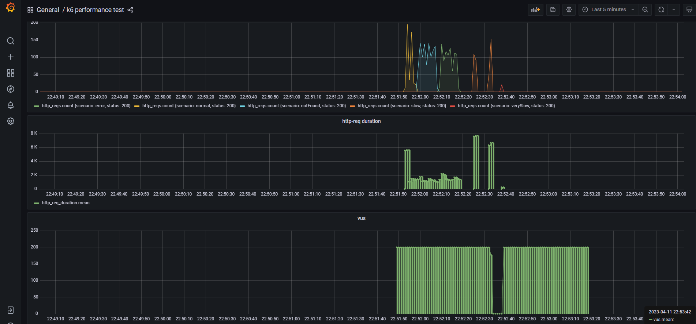

## Backend Dev Test

The purpose of this file is to explain and detail the implementation of the application, as well as to highlight other 
aspects.

### How to build the app?
The app can be build in two different ways, at the same time that you run grafana, simulado and influxdb or only running
the app alone.

If you want to run the app at the same time that the other containers, you should add a new parameter:
```
docker compose up -d simulado influxdb grafana spring-app
```
On the other hand, if you only want to run the app independently, you should run:
```
docker build -t app -f Dockerfile .
```
```
docker run -it -p 5000:5000 app .
```

### Some request examples
My app has only one request with the following structure:
```
http://localhost:5000/product/1/similar
http://host.docker.internal:5000/product/1/similar
```


### How to connect to the Docker host from inside a Docker container?
As you can see in the deployment file, there is a line that allows you to connect your Docker host from inside a Docker
container.
```
    extra_hosts:
      - "host.docker.internal:host-gateway"
```

### Logger information
The interface Slf4j from lombok, allows us to show every kind of log information like log debug, log info, log warn...
In each class that you need to show some logs, you need to put the annotation @Slf4j. I only put logs when there is a 
exception during the execution of the app.

### Swagger documentation
The documentation of the API is in the file product.yaml

### K6 evidence
 