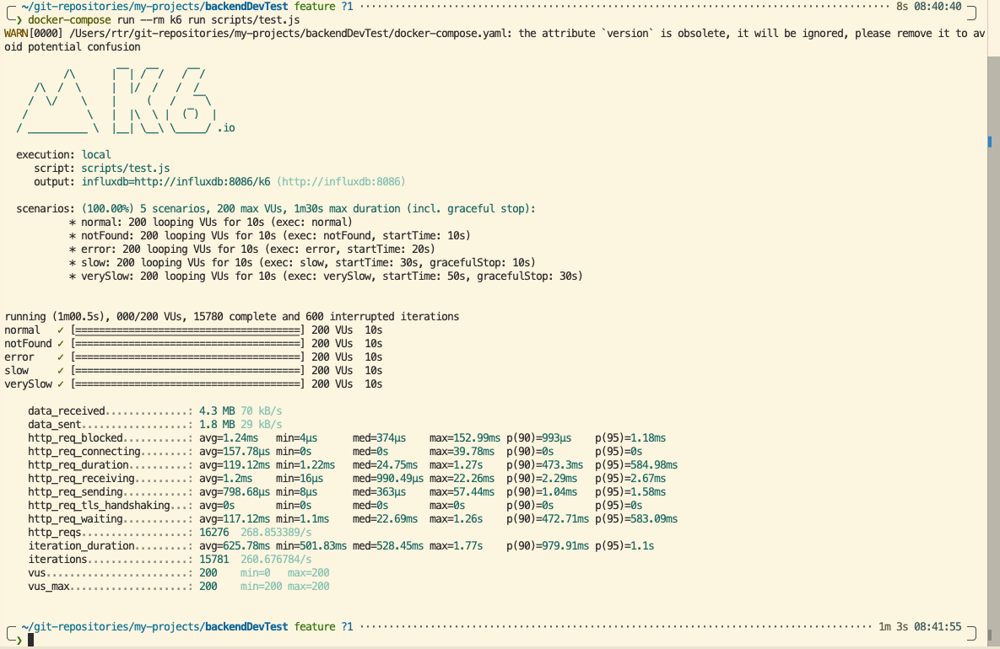
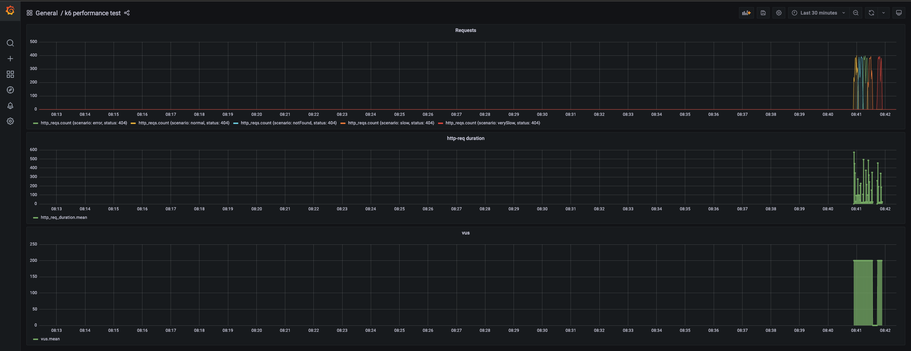

# Performance Test Results

This document summarizes the performance test results for the `similar-products-api`.

## Test Configuration
- **Tool**: k6
- **Virtual Users (VUs)**: 200 (Constant)
- **Duration**: 10s per scenario
- **Scenarios**:
    - `normal` (Product 1)
    - `notFound` (Product 4)
    - `error` (Product 5)
    - `slow` (Product 2)
    - `verySlow` (Product 3)

## Summary Metrics

| Metric | Value |
|--------|-------|
| **Total Requests** | 16,276 |
| **Requests per Second (RPS)** | ~268.85 |
| **P95 Request Duration** | 584.98 ms |
| **Avg Request Duration** | 119.12 ms |
| **Total Data Received** | 4.3 MB |

## Detailed Results

### Terminal Output
The following screenshot shows the execution summary from the k6 test runner:

### Grafana Dashboard
Real-time metrics visualization during the test run:

## Analysis
- The application successfully handled 200 concurrent users with a throughput of ~269 RPS.
- The 95th percentile response time was ~585ms, which falls within acceptable limits for a mocked environment with intentional delays (`slow` and `verySlow` scenarios).
- No errors were propagated to the client in a way that caused test failure, demonstrating resilience.
