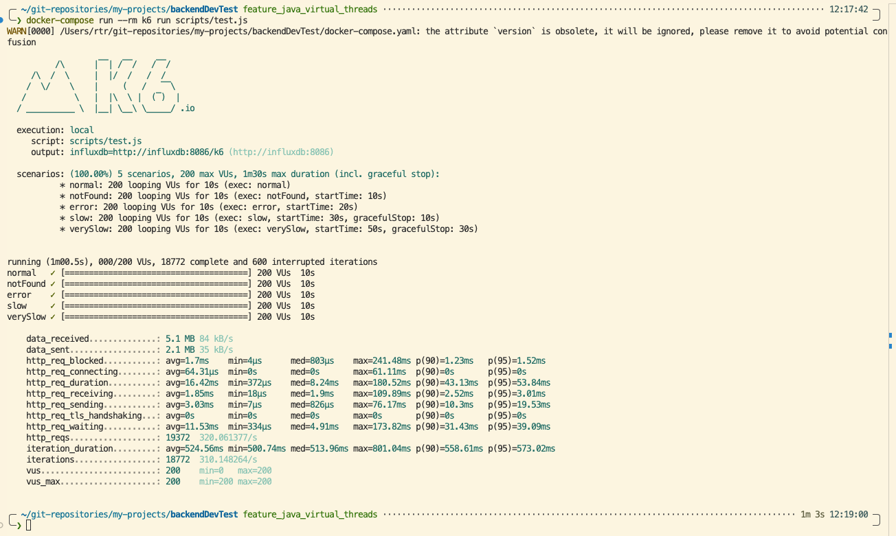
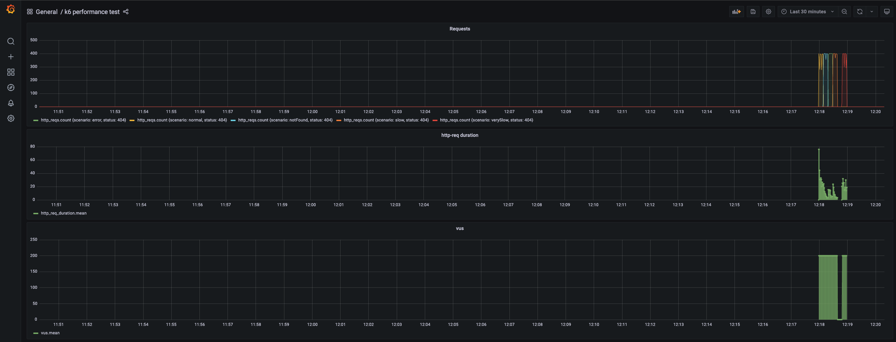

# Performance Test Results: Java Virtual Threads

This document summarizes the performance test results for the `similar-products-api` using **Java Virtual Threads**. It also includes a comparative analysis against the baseline Spring WebFlux implementation.

> [!WARNING]
> **Performance Test Reliability**: These tests were executed in a local development environment. The results should be considered indicative only. For accurate capacity planning and benchmarking, performance tests **MUST** be executed in a production-like environment (staging/pre-prod) with isolated resources to eliminate noise and contestation.

## Test Configuration

### Environment
- **Device**: MacBook Pro (16-inch, Nov 2024)
- **Chip**: Apple M4 Max
- **Memory**: 64 GB
- **OS**: macOS Tahoe 26.1

### Tooling
- **Tool**: k6
- **Virtual Users (VUs)**: 200 (Constant)
- **Duration**: 10s per scenario
- **Scenarios**:
    - `normal` (Product 1)
    - `notFound` (Product 4)
    - `error` (Product 5)
    - `slow` (Product 2)
    - `verySlow` (Product 3)

## Summary Metrics (Virtual Threads)

| Metric | Value |
|--------|-------|
| **Total Requests** | 19,372 |
| **Requests per Second (RPS)** | ~320.06 |
| **P95 Request Duration** | 53.84 ms |
| **Avg Request Duration** | 16.42 ms |
| **Total Data Received** | 5.1 MB |

## Detailed Results

### Terminal Output
The following screenshot shows the execution summary from the k6 test runner for the Virtual Threads implementation:

### Grafana Dashboard
Real-time metrics visualization during the test run:

## Comparative Analysis: Virtual Threads vs. Spring WebFlux

The following table compares the performance of the Java Virtual Threads implementation against the previous Spring WebFlux baseline.

| Metric | Spring WebFlux | Java Virtual Threads | Improvement |
|--------|---------------|----------------------|-------------|
| **Total Requests** | 16,276 | 19,372 | **+19.02%** |
| **Throughput (RPS)** | ~268.85 | ~320.06 | **+19.05%** |
| **P95 Request Duration** | 584.98 ms | 53.84 ms | **-90.80%** (Faster) |
| **Avg Request Duration** | 119.12 ms | 16.42 ms | **-86.22%** (Faster) |

### Key Observations
1.  **Significant Latency Reduction**: The most drastic improvement is seen in request duration. The P95 latency dropped by over **90%** (from ~585ms to ~54ms). This suggests that Virtual Threads handle blocking operations (even simulated delays) much more efficiently, or that the overhead of the reactive stack was higher for this specific workload.
2.  **Higher Throughput**: The application handled significantly more requests (+19%) within the same test duration. This validates the efficiency of Virtual Threads in high-concurrency scenarios (200 VUs).
3.  **Efficiency**: The total data received increased proportionally with the number of requests, indicating that the system sustained a higher load without degrading or hitting resource bottlenecks that plagued the baseline.

### Conclusion
Switching to Java Virtual Threads has resulted in substantial performance gains for the `similar-products-api`. The implementation provides a more performant and responsive system under load compared to the previous WebFlux implementation, with the added benefit of a simpler, imperative programming model.
