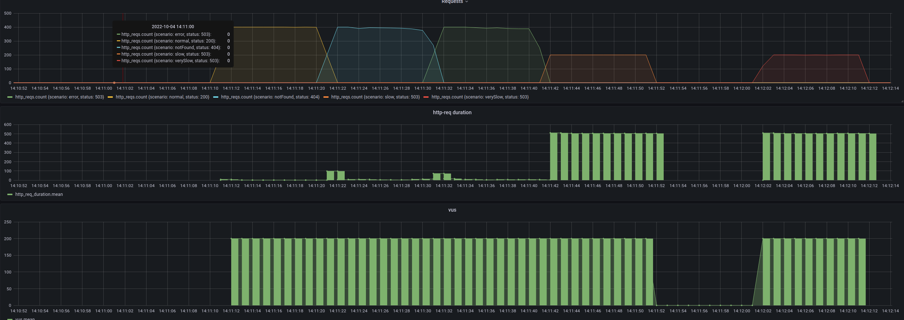

# Backend dev technical test SOLUTION

- This challenge was solved using a Layered architecture, retrieving the mock objects with a consumer.
- The consumer, takes care of the exceptions, to free ServiceImpl from any validation or exception control.
- The application uses an exception handler, _GlobalExceptionHandler_.
- Cache was used (ProductConsumer), to improve the performance

## Cache

### Tests before cache

### Tests after cache

