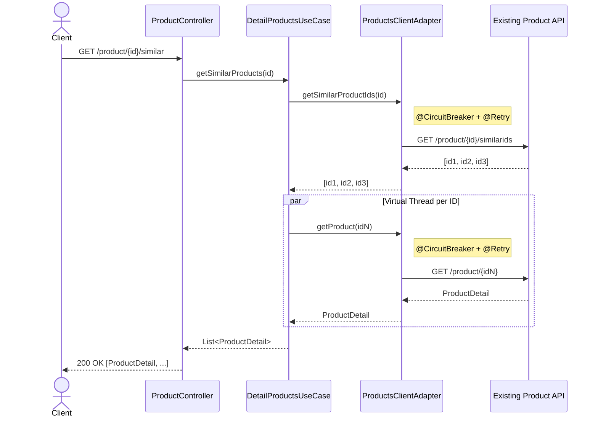
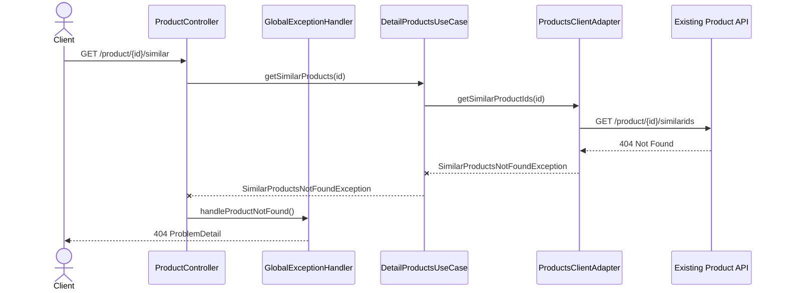

# Similar Products Service

REST microservice built with **Spring Boot 4** that exposes an endpoint to retrieve the details of products similar to a given one. The application consumes two existing APIs (similar product IDs and product detail) and aggregates the results into a single response.

## Tech Stack

| Technology | Version |
|---|---|
| Java | 26 |
| Spring Boot | 4.0.6 |

## Architecture

The project follows a **Hexagonal Architecture** (Ports & Adapters):

```
┌─────────────────────────────────────────────────────┐
│                   Infrastructure                    │
│                                                     │
│  ┌───────────────────┐       ┌───────────────────┐  │
│  │    Inbound        │       │    Outbound       │  │
│  │  (REST Controller)│       │  (REST Client +   │  │
│  │                   │       │   CircuitBreaker) │  │
│  └────────┬──────────┘       └───────▲───────────┘  │
│           │                          │              │
├───────────┼──────────────────────────┼──────────────┤
│           ▼       Application        │              │
│  ┌──────────────────────────────────────┐           │
│  │     DetailProductsUseCase            │           │
│  └──────────────────┬───────────────────┘           │
│                     │  ProductsPort (interface)     │
├─────────────────────┼───────────────────────────────┤
│                     ▼                               |
|                   Domain                            │
│  ┌──────────────────────────────────────┐           │
│  │  ProductDetail                       │           │
│  └──────────────────────────────────────┘           │
└─────────────────────────────────────────────────────┘
```

## Sequence Diagram



### Error flow (product not found)



## API

Swagger UI: [http://localhost:5000/swagger-ui/index.html](http://localhost:5000/swagger-ui/index.html)

### `GET /product/{productId}/similar`

Returns the list of similar products for the given product.

**Successful response (200):**

```json
[
  {
    "id": "2",
    "name": "Dress",
    "price": 19.99,
    "availability": true
  },
  {
    "id": "3",
    "name": "Blazer",
    "price": 29.99,
    "availability": false
  }
]
```

**Product not found (404):**

```json
{
  "type": "about:blank",
  "title": "Not Found",
  "status": 404,
  "detail": "Product not found: 999"
}
```

## Resilience

The service implements **Circuit Breaker + Retry** with Resilience4j to protect calls to the external APIs.

A single circuit breaker instance **`productsService`** is shared by both outbound calls:

### Circuit Breaker

| Parameter | Value |
|---|---|
| Sliding window size | 10 |
| Minimum number of calls | 5 |
| Failure rate threshold | 50% |
| Wait duration in open state | 10s |
| Permitted calls in half-open | 3 |
| Auto transition to half-open | yes |

### Retry

| Parameter | Value |
|---|---|
| Max attempts | 3 |
| Wait between retries | 500ms |

### Fallback behaviour

- **`getSimilarProductIds`** — returns an empty list (graceful degradation).
- **`getProduct`** — throws `ProductNotFoundException` (service unavailable).

## Performance

- Calls to fetch each similar product's detail are executed **in parallel** using **Virtual Threads** (`Executors.newVirtualThreadPerTaskExecutor()`).

## Prerequisites

- **Java 26**
- **Docker** and **Docker Compose** (for mocks and testing infrastructure)

## Running

### 1. Start mocks and infrastructure

```bash
docker-compose up -d simulado influxdb grafana
```

Verify the mocks are working: [http://localhost:3001/product/1/similarids](http://localhost:3001/product/1/similarids)

### 2. Start the application

```bash
cd similarproducts
./mvnw spring-boot:run
```

The application will be available at **http://localhost:5000**.

### 3. Test the endpoint

```bash
curl http://localhost:5000/product/1/similar
```

## Tests

### Unit and integration tests

```bash
cd similarproducts
./mvnw test
```

### Performance test (k6)

With the application and mocks running:

```bash
docker-compose run --rm k6 run scripts/test.js
```

Results in Grafana: [http://localhost:3000/d/Le2Ku9NMk/k6-performance-test](http://localhost:3000/d/Le2Ku9NMk/k6-performance-test)

k6 scenarios cover:
| Scenario | Product | Behavior |
|---|---|---|
| `normal` | 1 | Fast response |
| `slow` | 2 | Products with delay (1s) |
| `verySlow` | 3 | Products with extreme delay (5s-50s) |
| `notFound` | 4 | Non-existent similar product (404) |
| `error` | 5 | Server error (500) |

Each scenario runs **200 VUs** for **10 seconds**.
